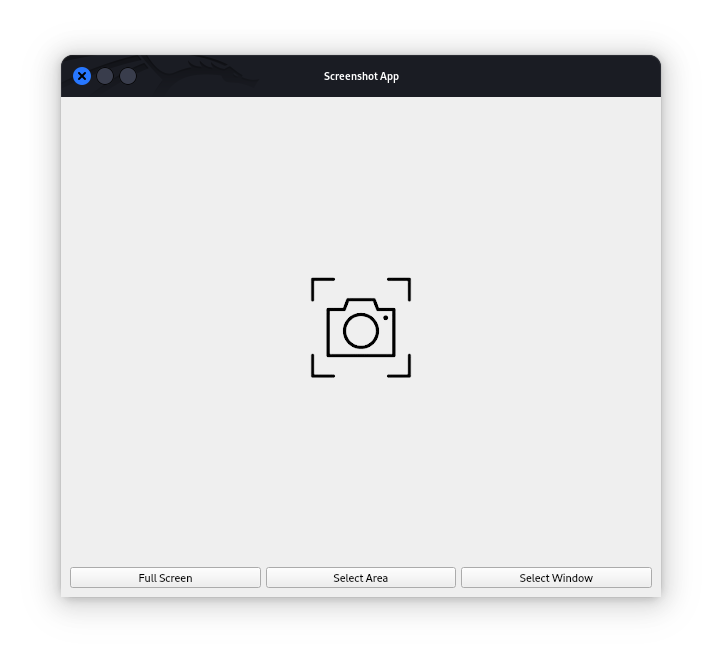
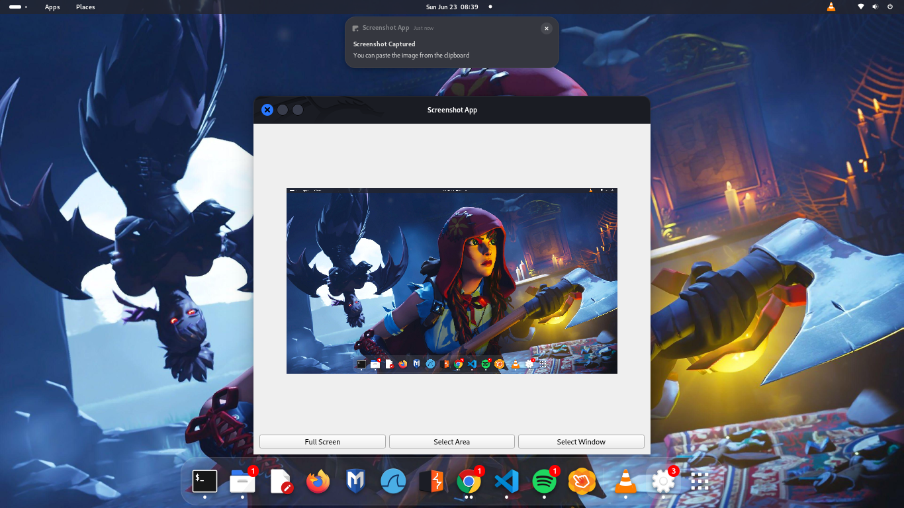
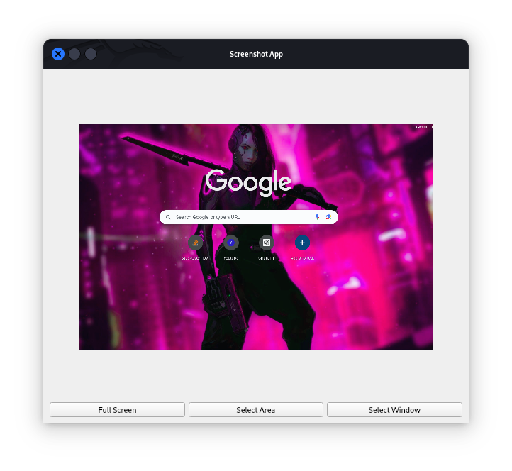
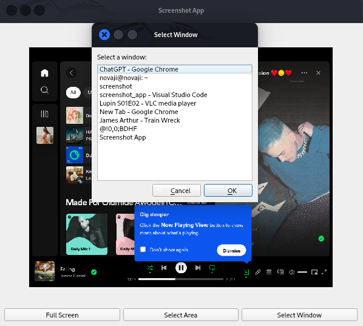

# Screenshot App

This Python Screenshot app allows users to capture screenshots in various ways: full screen, selected area, or specific window. It provides visual feedback during screenshot capture, plays a sound effect, and supports clipboard integration for easy sharing.

## Features

- **Capture Modes:**
  - **Full Screen:** Capture the entire screen.
  - **Select Area:** Capture a specific area by dragging a selection.
  - **Select Window:** Choose a specific window to capture.

- **Visual Feedback:** A dimming overlay indicates when a screenshot is being taken.
  
- **Sound Effect:** A sound effect plays when a screenshot is captured.

- **Clipboard Integration:** Captured screenshots are placed in the clipboard for easy sharing.

### Prerequisites

- Python 3.x
- PyQt5 library (`pip install PyQt5`)
- `pyautogui` library (`pip install pyautogui`) for screen capturing
- Linux: `wmctrl` and `xwininfo` for window capturing (Install via package manager)

## Installation

1. Clone the repository:

    ```sh
    git clone https://github.com/Cypher-O/screenshot_app.git
    cd screenshot_app
    ```

2. Install dependencies:

    ```sh
    pip install -r requirements.txt
    ```

## Usage

To run the application, use the following command from the project directory:

    ```sh
    python main.py
    ```

## How to Use

1. **Full Screen Capture:**
    - Click the 'Full Screen' button to capture the entire screen.

2. **Select Area Capture:**
    - Click the 'Select Area' button, then click and drag to select the area to capture.

3. **Select Window Capture:**
    - Click the 'Select Window' button, then click the window you want to capture.

4. **Viewing Screenshots:**
    - Captured screenshots are displayed with options to save or copy to clipboard.

## Contributing

Contributions are welcome! Please read [CONTRIBUTING.md](CONTRIBUTING.md) for details on our code of conduct and the process for submitting pull requests.

## License

This project is licensed under the MIT License - see the [LICENSE](LICENSE) file for details.

## Screenshots

<table>
    <tr>
        <td>
            
            <p>Screenshot App</p>
        </td>
        <td>
            
            <p>Full Screen Capture</p>
        </td>
        <td>
            
            <p>Select Area Capture</p>
        </td>
         <td>
            
            <p>Select Window Capture</p>
        </td>
    </tr>
</table>
